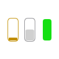
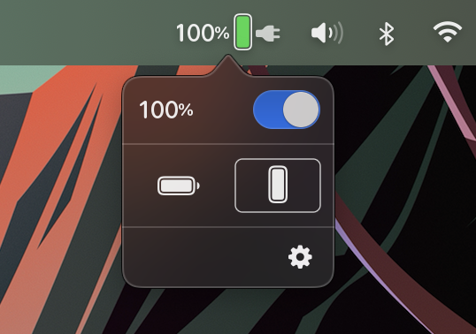
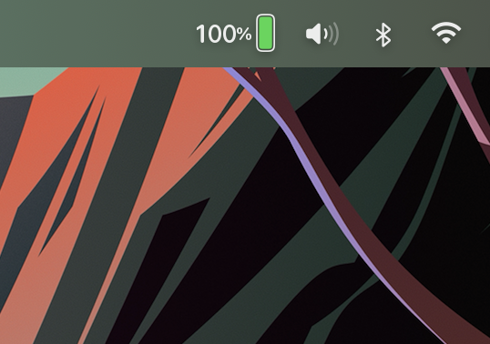
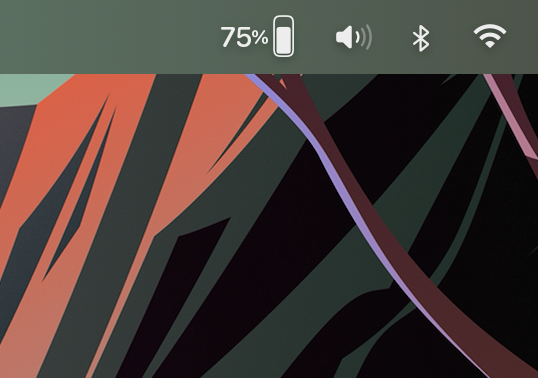
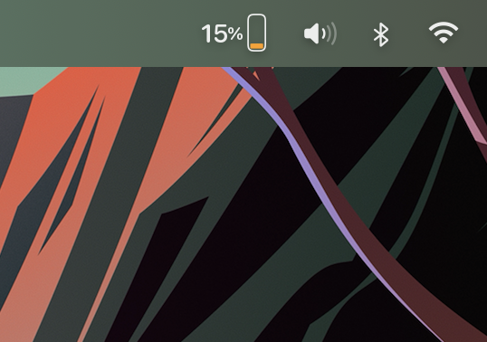

## GreenBattery app for macOS

Clean and simple battery status indicator!

### Description

High quality app to monitor the battery charge level of your MacBook.

Easily change the battery icon orientation and decide if you want to display the percentage.

The app will display a power plug icon when your MacBook is connected to a power source.

From the technical standpoint, the app was built with the efficiency in mind because an app that monitors the battery should consume as little power as possible.

If you choose to "Launch GreenBattery App at Login" on the Welcome screen then the app will be launched automatically at login. However, this feature may not work on all systems. It depends on your security settings. If that's the case, then you can do it manually in System Preferences -> Users & Groups -> Choose your user -> Login Items -> Click "plus" sign and add GreenBattery to the list.

### Requirements

- macOS 12.0+ (Monterey and later)

### Install

Get GreenBattery app from [Apple App Store](https://www.apple.com/app-store/).

### Screenshots

